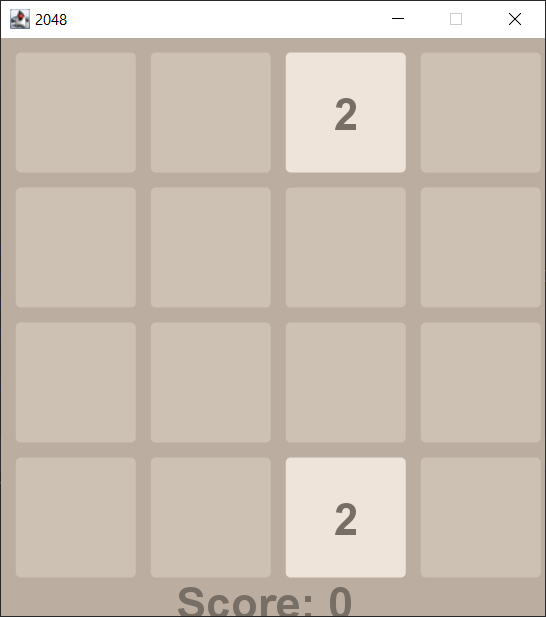
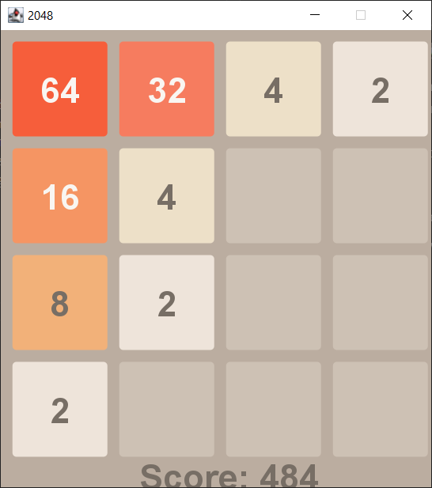
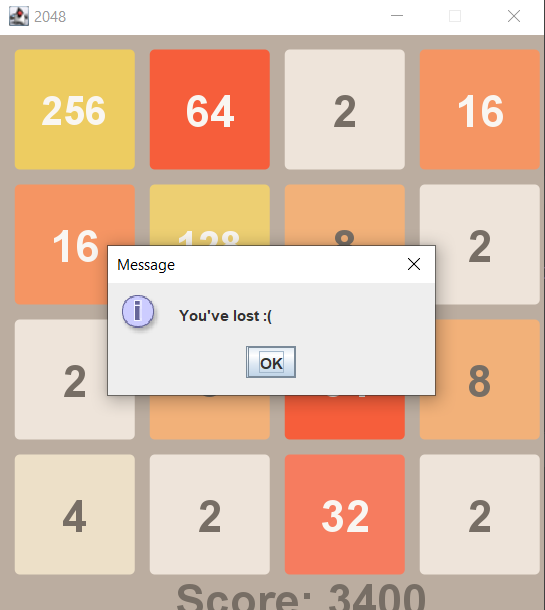
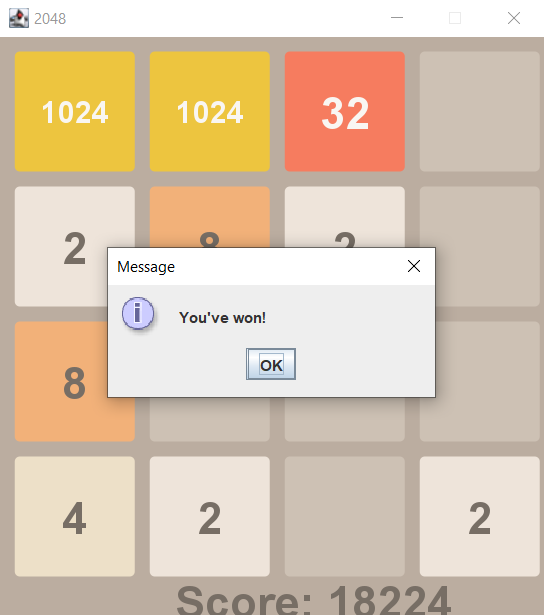

# 2048

This project is a 2048 game.

You can move using the up, down, right and left buttons.

You need to connect the same numbers to get a larger number. The greater the sum of the numbers on the field, the greater the score. All the action takes place on a 4x4 field. The player controls the movement of numbers using swipes; with each new movement, a new digit appears on the field – in 90% of cases it is 2, in the remaining 10% it is 4. 

The game ends when all the fields or a step are filled, which should result in the number 2048.

The project uses the MVC software architectural pattern.

And it uses swing.